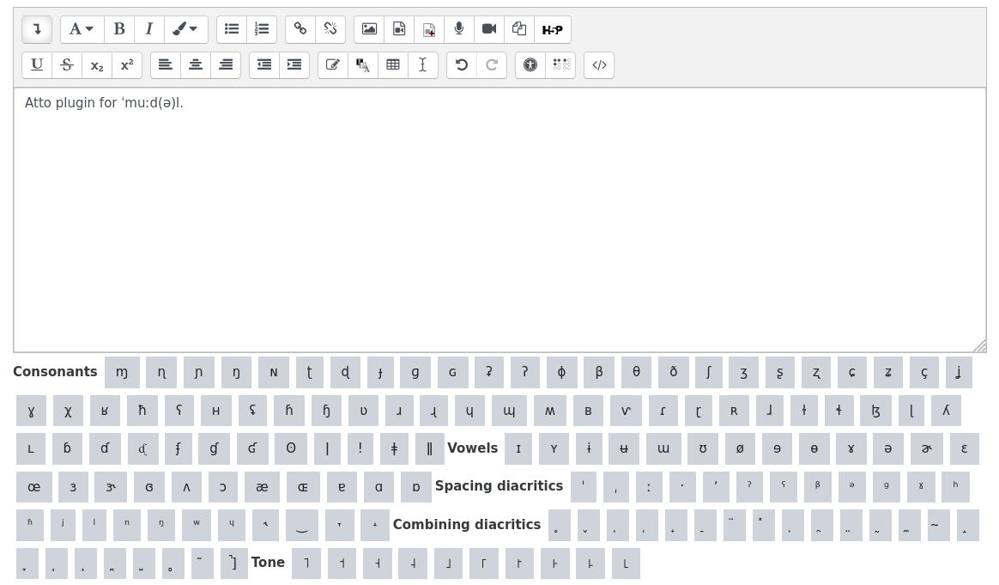

# Plugin Atto pour aider à la saisie de caractères phonétiques.

[](https://github.com/actions/starter-workflows/actions?query=workflow%3AMoodle%20Plugin%20CI)

[](https://moodle.org)

Ce plugin pour l'éditeur de texte Atto de [Moodle](https://moodle.org) réimplémente le clavier virtuel d'aide à la saisie des caractères phonétiques du logiciel [MediaWiki](https://www.mediawiki.org).

## Installation
```bash
git clone https://github.com/DSI-Universite-Rennes2/moodle-atto_ipakeyboard.git /path/to/your/moodle/lib/editor/atto/plugins/ipakeyboard
php /path/to/your/moodle/admin/cli/upgrade.php
```

## Capture d'écran


## Licence
[GNU General Public License v3](https://www.gnu.org/licenses/gpl.txt)
